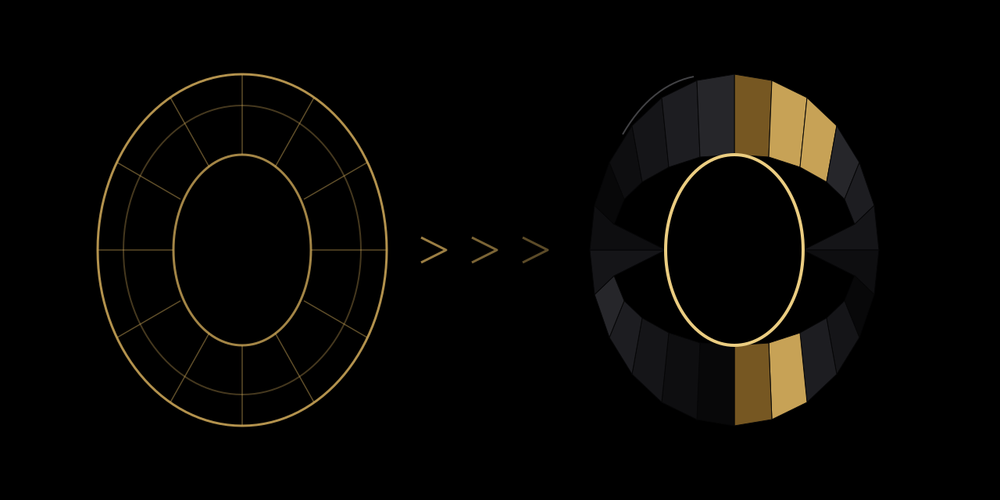

# Obsidian Gold Image Pipeline

A mono-style Agent Skill for turning one or more visual references into one isolated black-and-gold digital sculpture, or for repairing an existing Obsidian Gold asset under explicit preservation constraints.



The repository cover is a self-authored deterministic geometry example approved in [OGP#12](https://github.com/sevranty/obsidian-gold-image-pipeline/issues/12). It demonstrates the transformation contract visually without claiming live third-party generator quality.

## Status

| Item | Value |
| --- | --- |
| Skill version | `0.1.0` |
| Release candidate | `0.1.0-rc.1` |
| Publication | Not published |
| Deterministic pilot evidence | PASS |
| Repository cover | Approved OGP#12 canonical SVG |
| Live image-generator aesthetic claim | Not established |
| GitHub Actions claim | None |

The repository validates workflow contracts, package structure, prompt checks, raster inspection, delivery records, failure handling, and clean installation. It does not bundle an image-generation model and does not guarantee the aesthetic quality of an external generator.

## Visual formula

```text
recognizable reference evidence
  -> one selected subject or one fused metaphor
  -> faceted or planar geometry
  -> matte obsidian-black material
  -> controlled satin-gold accents
  -> pure black background
  -> readable isolated silhouette
```

The default output is one square raster image. The subject must remain recognizable, while source lighting, materials, background, incidental objects, text, logos, and watermarks are removed or replaced by the Obsidian Gold system.

## Use this skill for

- creating one isolated Obsidian Gold object from one or more visual references;
- reducing a complex scene to one physical subject or one fused metaphor;
- translating an animal into a faceted sculptural form while preserving its defining silhouette;
- translating a person into a generic sculptural figure or a safer semantic object;
- repairing one existing Obsidian Gold image while preserving declared invariants;
- validating prompt structure, raster properties, QA evidence, manifests, and delivery state.

## Do not use this skill for

- multi-style routing or style selection;
- full narrative scenes, interiors, landscapes, or environmental backgrounds;
- photorealistic product rendering;
- exact real-person likeness;
- exact text, logo, trademark, or watermark reproduction;
- basic crop, resize, or color-correction work;
- SVG, HTML, or CSS substitutes when the requested result is a raster image;
- unattended aesthetic acceptance without visual review.

## Input roles

Every input image receives one or more explicit roles.

| Role | Purpose |
| --- | --- |
| `content_reference` | Subject and semantic meaning |
| `silhouette_reference` | Outer contour, pose, or proportion guidance |
| `detail_reference` | One declared recognition feature |
| `composition_reference` | Weak orientation or framing guidance |
| `edit_target` | Existing Obsidian Gold image to change |
| `do_not_copy` | Context that must not be reproduced literally |

Conflicting references do not silently overwrite each other. The workflow records uncertainty and stops when the conflict changes subject identity.

## Generate and edit modes

### Generate

Create a new object from reference evidence. Preserve declared meaning, recognition features, and silhouette guidance. Replace source materials, lighting, background, and incidental scene content with the normalized Obsidian Gold system.

### Edit

Change one explicit property of an existing Obsidian Gold asset. Record the `edit_target`, one requested change, and all `keep_unchanged` invariants. Switch to generate mode when subject, silhouette, camera, crop, and material system all require replacement.

## Required workflow

```text
validate target
  -> classify generate or edit
  -> assign input roles
  -> analyze reference evidence
  -> select one subject or fused metaphor
  -> write transformation contract
  -> write scene specification
  -> build generator-neutral instruction
  -> run deterministic prompt validation
  -> generate or edit with the available executor
  -> inspect full-size raster and 64x64 silhouette
  -> apply critical gate and weighted QA
  -> accept, repair, regenerate, or stop
  -> build manifest and package
  -> deliver the accepted image visibly
```

A successful tool call is not completion. An output that cannot be inspected and made visible is `DELIVERY_MISSING`.

## Quick start from a checkout

### 1. Install the declared raster dependency

```bash
python3 -m pip install -r skill/obsidian-gold-image-pipeline/requirements.txt
```

The current requirement is `Pillow>=10.0,<13.0`.

### 2. Build the deterministic skill archive

```bash
python3 scripts/build_skill_package.py \
  --archive /tmp/ogp-skill.zip \
  --manifest /tmp/ogp-skill-manifest.json
```

The archive contains one root folder named `obsidian-gold-image-pipeline`. Repository-only files such as this README, research, reports, and evaluation corpora are excluded from the installed bundle.

### 3. Run the clean-install smoke test

```bash
python3 scripts/smoke_test_install.py \
  --archive /tmp/ogp-skill.zip \
  --manifest /tmp/ogp-skill-manifest.json \
  --report /tmp/ogp-install-smoke.json
```

The smoke contract extracts the archive under `.agents/skills/obsidian-gold-image-pipeline`, checks four CLI `--help` commands, verifies the archive checksum, and runs one installed prompt-validation fixture. Use the supported skill directory for the target agent when it differs from `.agents/skills`.

### 4. Invoke the installed skill

A repository-defined example prompt is:

```text
Create or repair one isolated Obsidian Gold object from the attached reference and deliver the validated image.
```

A usable image reference or edit target must be attached. The skill stops rather than inventing a missing target.

## Transformation contract example

This example is a structural fixture, not a claim of live generator quality.

```text
mode: generate
input_role: content_reference
selected_primary_subject: tracked vehicle
preserve:
  - recognizable vehicle category
  - outer contour
  - key proportions
simplify:
  - minor mechanical detail
  - incidental surface texture
remove:
  - environment
  - text
  - logos
  - watermark
replace:
  - source material -> matte manufactured obsidian-black
  - source highlights -> controlled satin-gold accents
  - source background -> pure black
output:
  - one isolated square PNG raster
  - readable silhouette at 64x64
```

## Quality gates

An output can be accepted only when:

- the subject or fused metaphor is recognizable;
- no critical visual defect remains;
- the weighted QA verdict permits acceptance;
- the silhouette is readable at 64x64;
- the full-size raster has no blocking artifact;
- prompt and raster checks have no blocking error;
- the accepted asset has a reproducible manifest and non-destructive package;
- the actual final image is visible or directly accessible to the user.

The iteration budget is one initial generation, up to two targeted repairs, and one full regeneration after failed repairs. Each repair addresses one diagnostic category.

## Evidence and release status

| Evidence | Current result |
| --- | --- |
| [OGP#9 baseline](reports/ogp9-baseline.json) | PASS for static trigger, workflow, failure-path, style-regression, and manual visual-rubric contracts |
| [OGP#13 pilot report](reports/ogp13-pilot.json) | PASS for deterministic pilot evidence |
| [Pilot validation review](docs/reviews/ogp13-pilot-validation.md) | 5 accepted structural cases, visible delivery records, failure recovery, and clean-install smoke |
| [Install smoke report](reports/ogp13-install-smoke.json) | PASS |
| [Package manifest](dist/ogp-skill-manifest.json) | `0.1.0-rc.1`, `release_published: false` |
| [Cover validation](docs/reviews/ogp12-cover-validation.md) | ACCEPT, 95/100, no critical defects |

The pilot uses deterministic programmatic fixtures. It validates orchestration and artifact contracts but does not establish live third-party image-generator aesthetic success. No tag, GitHub Release, marketplace submission, committed release archive, or public binary has been published.

## Visual examples

The repository cover is the approved OGP#12 visual example. It uses one self-authored portal subject shown as a wireframe reference and a faceted final state. The committed source of truth is SVG; raster PNG/WebP exports were generated and inspected during review but remain build outputs rather than versioned release binaries.

- Cover: [`assets/repository-cover.svg`](assets/repository-cover.svg)
- Social-preview source: [`assets/social-preview.svg`](assets/social-preview.svg)
- Source: [`assets/source/reference-portal-wireframe.svg`](assets/source/reference-portal-wireframe.svg)
- Manifest and export checksums: [`assets/cover-source-manifest.json`](assets/cover-source-manifest.json)
- Benchmark and concept decision: [`docs/research/project-cover-benchmark.md`](docs/research/project-cover-benchmark.md)
- QA review: [`docs/reviews/ogp12-cover-validation.md`](docs/reviews/ogp12-cover-validation.md)

This asset demonstrates the repository's transformation contract. It is not presented as proof of live external image-generator quality.

## Repository structure

```text
README.md                         public project entry point
CONTRIBUTING.md                   contribution and review contract
assets/                           canonical SVG cover, social preview, concepts, source and manifest
docs/architecture.md              scope and component boundaries
docs/research/                    public research and comparisons
docs/reviews/                     review and validation records
evals/                            trigger, workflow, failure, and visual fixtures
examples/                         repository-level examples and evidence
reports/                          machine-readable validation output
dist/                             release-candidate manifest; generated zip is not committed
scripts/                          repository build, smoke, and evaluation tools
skill/obsidian-gold-image-pipeline/
  SKILL.md                        runtime entry point
  agents/openai.yaml              user-facing skill metadata
  references/                     progressive-disclosure runtime contracts
  assets/                         installed templates and anchors
  scripts/                        deterministic runtime helpers
  requirements.txt                installed Python dependency contract
  VERSIONS.json                   version matrix
  LICENSE.txt                     bundled license
```

Only `skill/obsidian-gold-image-pipeline/` is intended for installation.

## Source of truth

- Runtime order: [SKILL.md](skill/obsidian-gold-image-pipeline/SKILL.md)
- Architecture and non-goals: [docs/architecture.md](docs/architecture.md)
- Style invariants: [style-definition.md](skill/obsidian-gold-image-pipeline/references/style-definition.md)
- Concrete tokens: [style-tokens.md](skill/obsidian-gold-image-pipeline/references/style-tokens.md)
- Reference roles: [reference-analysis.md](skill/obsidian-gold-image-pipeline/references/reference-analysis.md)
- Transformation decisions: [transformation-contract.md](skill/obsidian-gold-image-pipeline/references/transformation-contract.md)
- Visual acceptance: [visual-quality-assurance.md](skill/obsidian-gold-image-pipeline/references/visual-quality-assurance.md)
- Delivery states: [delivery-contract.md](skill/obsidian-gold-image-pipeline/references/delivery-contract.md)
- Version matrix: [VERSIONS.json](skill/obsidian-gold-image-pipeline/VERSIONS.json)

The README links these contracts and does not redefine their normative values.

## Research decisions

The public documentation structure was compared with current OpenAI Agent Skills guidance, the OpenAI `skill-creator` and `imagegen` examples, the Agent Skills open-standard ecosystem, and a small set of public skill repositories. See [analogous-skills-analysis.md](docs/research/analogous-skills-analysis.md).

The repository cover decision is documented in [project-cover-benchmark.md](docs/research/project-cover-benchmark.md).

## Contributing

Read [CONTRIBUTING.md](CONTRIBUTING.md) before changing runtime contracts, validation, evidence, or public documentation. Use one Issue, one focused branch, and one reviewed Pull Request per concern. Do not publish a release from a contribution PR.

## License

The repository and installed skill bundle use the MIT License. The root [LICENSE](LICENSE) and bundled [LICENSE.txt](skill/obsidian-gold-image-pipeline/LICENSE.txt) must remain byte-identical.
